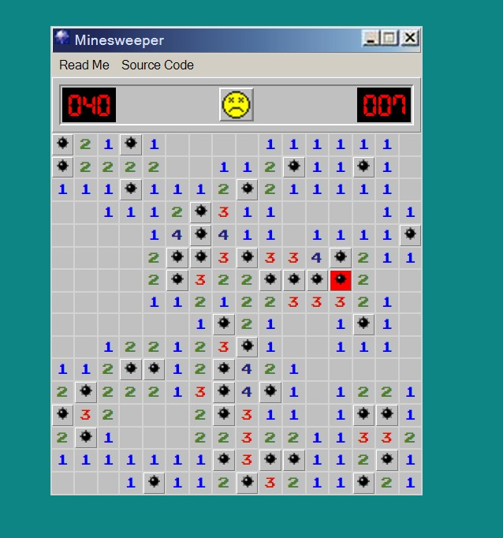

# Minesweeper

Minesweeper is a classic single-player puzzle game where the objective is to clear a rectangular board containing hidden "mines" or bombs without detonating any of them, with help from clues about the number of neighboring mines in each field. 
Some Minesweeper history [here](https://en.wikipedia.org/wiki/Minesweeper_(video_game)).

Do you know what an actual Minesweeper is? I didn't either until I read [this](https://en.wikipedia.org/wiki/Minesweeper).

I remember my first experience with computers in the 90's involved playing this game a lot, so I thought what better game than this to come full circle?

## My Version

### Basic Gameplay
1. Select your difficulty level.
* Easy = 9x9, 10 mines
* Medium = 16x16, 40 mines
* Hard = 30x30, 160 mines
2. Click anywhere on the board to begin and start the timer.
*The numbers depict how many mines are adjacent to any given cell.
3. Use **"Shift + Click"** to add flags to a cell if you think it's a mine.

## Technologies Used
The good old Three Amigos:
* HTML
* CSS
* JavaScript

### HTML
As you can see from the source code, the HTML is very concise, as most of the action happens in the JavaScript. Not to mention, the gameboard itself is just a simple table.

### CSS
I had a lot of fun styling this to the old look of the Windows '95 desktop view. I still want to mess around with it a bit to get it perrrrfect (couldn't find the exact font used by MS).

My biggest challenge with the CSS was figuring out the table styles (borders, td sizes, etc.)

### JavaScript
As this was my first time ever writing a functioning web app using JavaScript, it's not a big surprise that this section was by far the greatest challenge of the project for me. 

Here are a couple highlights:

1. Dynamically sizing the table when clicking a difficulty level
* I created a function (with the help of Jim, of course) which parses the number from the ID on the table which converts it into a ${size} variable which basically appends rows/cols based on the number it grabs. This concept blew my mind.
2. In turn, dynamically creating an array of arrays to match the visual table.
3. Creating a "Cell" class which I used to create individual "cell objects" which I assigned a ton of properties to: row#, col#, bomb t/f, # of adjacent bombs (another challenge in and of itself, btw), revealed t/f, and flagged t/f.
* This approach made it a lot easier to write more concise code and not repeat myself over and over, as well as create methods on the class that would run for every cell object.
4. Creating a functional timer that displayed the seconds elapsed.
5. Randomizing bomb placement on the array.
6. Rendering everything in the DOM.
7. Assigning click handlers to different events.
8. Creating win/lose logic
9. Figuring out the control flow of how the functions are all chained together synchronously.
10. Learning about **recursion** and how to properly write a function that creates such an effect.

## My Design Choices

I decided to roll with the OG Windows '95 look. I am a firm believer in the "Imitate. Assimilate. Innovate." model of learning, so figured for my first project I needed to walk before I could run and start with the imitation phase of the learning process.

## Next Steps!
This project really was a lot of fun for me. I plan to continue to refine it and refer back to the many lessons learned for years to come.

* Like I mentioned earlier, I would love to make a "display toggle" which flips the CSS to a modernized, clean, flat, minimalist UI.
* There are some stupid little aesthetic bugs that are making me pull my hair out, like how the cell width/height gets tweaked by a few pixels when the board is totally revealed. I need to fix that.
* I would also love to flesh out the Windows '95 thing more, making the Start button do something, add a clock to the bottom right corner, and some functional desktop icons.
